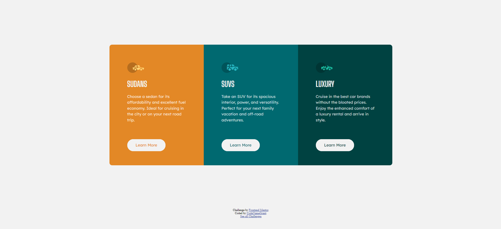

# Frontend Mentor - Order summary card solution

This is a solution to the [3-column preview card component challenge on Frontend Mentor](https://www.frontendmentor.io/challenges/3column-preview-card-component-pH92eAR2-). Frontend Mentor challenges help you improve your coding skills by building realistic projects.

### Screenshot

Challenge Complete.

### Links

- Solution URL: [Solution](https://www.frontendmentor.io/solutions/ordersummary-component-tzhgpErV4)
- Live Site URL: [Live Demo](https://codenamegrant.github.io/frontend-mentor/newbie/3-column-preview-card-component/)

## Author

- Git - [CodeNameGrant](https://github.com/CodeNameGrant)
- Frontend Mentor - [@CodeNameGrant](https://www.frontendmentor.io/profile/CodeNameGrant)
